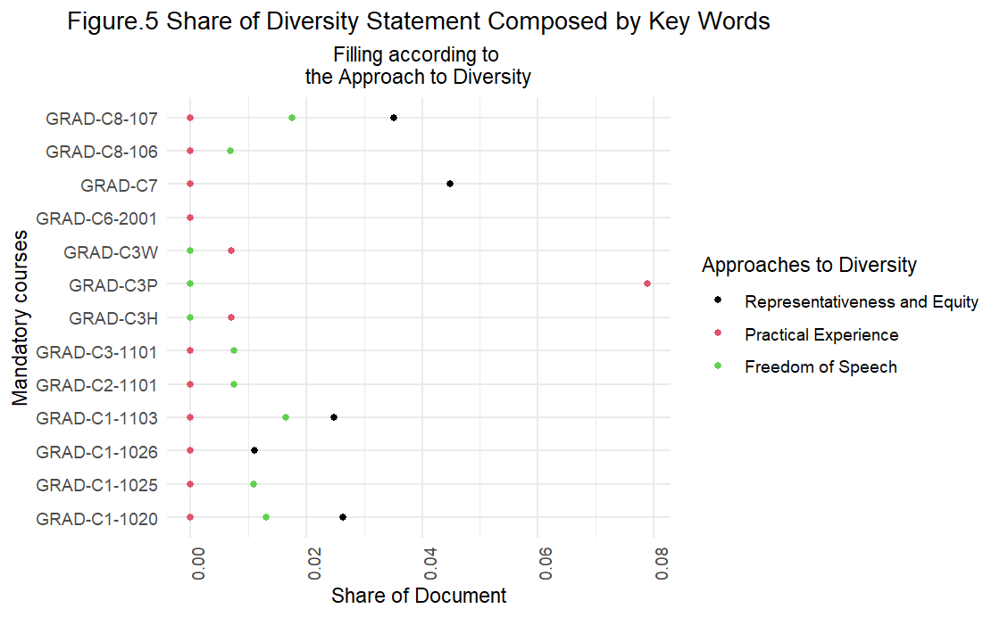

```{r setup, include=FALSE}
knitr::opts_chunk$set(echo = FALSE)

pacman::p_load(rmdformats, tidyverse, stringr, pdftools, gender, ggplot2, quanteda.sentiment, quanteda, tidyr, gridExtra, tm, gender) #add here the libraries you are using
library(quanteda)
library(quanteda.sentiment)
library(ggplot2)
```

```{r,fig.align='left', echo=F, out.width = "100%", fig.cap= "_Note: image's credits to the Hertie School diversity and inclusion website_"}


```


```{r functions, echo=FALSE}
#functions #this should be hidden


##1. Diversity statement function##

read_div_statement <- function(syllabus_pdf){
  
  #Cut it by lines
  syllabus_l<-scan(textConnection(syllabus_pdf), what="character",sep = "\n")
  #make it a dataframe 
  syllabus_df<-as.data.frame(unlist(syllabus_l)) 
  #change name of column
  names(syllabus_df)[1] <- "lines"
  #syllabus_df<-tolower(lines)
  
  #find the Diversity statement line
  diversity_line<-grep("Diversity Statement", syllabus_df$lines)
  
  if (length(diversity_line)==0) {
    #Diversity statement
    diversity_line<-grep("Diversity statement", syllabus_df$lines)
  } 
  #find the Grading line
  assignment_line<- grep("Grading and Assignments", syllabus_df$lines)
  
  if(length(diversity_line)!=0)
  {
  #the diversity statement is between these tw
   diversity_df<-syllabus_df %>%
    slice((diversity_line+1):(assignment_line-1))
  
  #take out those lines that have exactly one character 
  diversity_df<-diversity_df %>%
    filter(nchar(as.character(lines))!=1)

  #create a string
  div_statement<-paste(diversity_df$lines,collapse=" ")
  
  div_statement<- div_statement %>%str_remove(.,"[:digit:]") %>% str_trim(.)
  } else{
    div_statement="NULL"
  }
  div_statement
}


#. 2. Split readings function

split_readings<-function(complete_df,no_c){ #1
  for (i in 22:33){ #2
    add_readings<-as.data.frame(complete_df[no_c,i])
    names(add_readings)[1]<-"readings"
    
    if (i==22) { #3
      split_readings_df<-rbind(add_readings)
    }else{  #3 - #4
      split_readings_df<-rbind(split_readings_df,add_readings)
    }  #4  
    
  } #2

  split_readings_df<-as.data.frame(unlist(split_readings_df))
  names(split_readings_df)[1]<-"reading_list"
  
  split_readings_df<-split_readings_df%>%
    mutate(reading_list=str_trim(reading_list))
  
  split_readings_df
  
} 

##3. Split names function

split_names<-function(readings_l){
  
  for (i in 1:nrow(readings_l)) {
    
    a<-word(readings_l[i,1],1) %>%
      str_remove(.,"[:punct:]") %>%
      str_trim(.)
    
    b<-word(readings_l[i,1],2) %>%
      str_remove(.,"[:punct:]")%>%
      str_trim(.)
    
    names_df<-data.frame(a,b)
    names(names_df)[1]<-"last_name"
    names(names_df)[2]<-"name_name"
    
    if (i==1) { 
      final_names_df<-rbind(names_df)
    }else{
      final_names_df<-rbind(final_names_df,names_df)
    }  
  }
  
  final_names_df
}

##4. Percentage of females ###

percentage_female<-function(reading_names) {
  
  list_names<-reading_names$name_name
  
  list_names<-list_names %>%
    str_remove(.,"[:punct:]")%>%
    str_trim(.)
  
  count_a<-gender(list_names)%>%
    group_by(gender) %>%
    summarise(n=n()/nrow(.))
  
  if (nrow(count_a)==2) {
    result<-unlist(count_a[1,2])
  }else{
   result<-0
    }
  
  
  result
}

```


```{r load-diversity-statements}

working_directory<-getwd()
list_syllabi<-list.files("./syllabi_pdfs")
pdfs<-map(paste0(working_directory,"/syllabi_pdfs/",list_syllabi),pdf_text)
a<-map(pdfs,read_div_statement)
div_statement_df<-data.frame(unlist(list_syllabi),unlist(a))

```

```{r getting-readings, include=FALSE}

## Integrating diversity statement scrapping data frame to second data frame with courses' basic and readings information 

gathered_courses_data_vf <- read_csv("gathered_courses_data_vf.csv") ## uploading gathered information about Professors and readings

complete_df <- div_statement_df %>%  ## Including key column for left join
  mutate(observation = 1:n())

complete_df <- dplyr::left_join(complete_df, gathered_courses_data_vf, by = "observation") ## Left joining information to complete data frame

## complete_df<-readr::read_csv("div_stats_last.csv") ## Delete before turning in

complete_df<-complete_df %>%
  mutate(sep_read_1=str_split(Readings_1,";"))

complete_df<-complete_df %>%
  mutate(sep_read_2=str_split(Readings_2,";"))

complete_df<-complete_df %>%
  mutate(sep_read_3=str_split(Readings_3,";"))

complete_df<-complete_df %>%
  mutate(sep_read_4=str_split(Readings_4,";"))

complete_df<-complete_df %>%
  mutate(sep_read_5=str_split(Readings_5,";"))

complete_df<-complete_df %>%
  mutate(sep_read_6=str_split(Readings_6,";"))

complete_df<-complete_df %>%
  mutate(sep_read_7=str_split(Readings_7,";"))

complete_df<-complete_df %>%
  mutate(sep_read_8=str_split(Readings_8,";"))

complete_df<-complete_df %>%
  mutate(sep_read_9=str_split(Readings_9,";"))

complete_df<-complete_df %>%
  mutate(sep_read_10=str_split(Readings_10,";"))

complete_df<-complete_df %>%
  mutate(sep_read_11=str_split(Readings_11,";"))

complete_df<-complete_df %>%
  mutate(sep_read_12=str_split(Readings_12,";"))


readings_bauer<-split_readings(complete_df,1)
reading_list_bauer<-split_names(readings_bauer)


readings_ahrens<-split_readings(complete_df,2)
reading_list_ahrens<-split_names(readings_ahrens)


readings_gruener<-split_readings(complete_df,3)
reading_list_gruener<-split_names(readings_gruener)

readings_lancker<-split_readings(complete_df,4)
reading_list_lancker<-split_names(readings_lancker)

readings_patz<-split_readings(complete_df,5)
reading_list_patz<-split_names(readings_patz)

readings_jachten<-split_readings(complete_df,6)
reading_list_jachten<-split_names(readings_jachten)

readings_costello<-split_readings(complete_df,7)
reading_list_costello<-split_names(readings_costello)

readings_bosch<-split_readings(complete_df,8)
reading_list_bosch<-split_names(readings_bosch)

readings_bobic<-split_readings(complete_df,9)
reading_list_bobic<-split_names(readings_bobic)

readings_wucher<-split_readings(complete_df,10) #this is missing
reading_list_wucher<-split_names(readings_wucher)


readings_dkt<-split_readings(complete_df,11) #this is missing
reading_list_dkt<-split_names(readings_dkt)

readings_hassel<-split_readings(complete_df,12)
reading_list_hassel<-split_names(readings_hassel)


readings_hickman<-split_readings(complete_df,13)
reading_list_hickman<-split_names(readings_hickman)

readings_graf<-split_readings(complete_df,14)
reading_list_graf<-split_names(readings_graf)

readings_migliorati<-split_readings(complete_df,15)
reading_list_migliorati<-split_names(readings_migliorati)


readings_hustedt<-split_readings(complete_df,16)
reading_list_hustedt<-split_names(readings_hustedt)

readings_parrado<-split_readings(complete_df,17)
reading_list_parrado<-split_names(readings_parrado)

readings_wegrich<-split_readings(complete_df,18)
reading_list_wegrich<-split_names(readings_wegrich)

readings_kayser<-split_readings(complete_df,19)
reading_list_kayser<-split_names(readings_kayser)

readings_munzert<-split_readings(complete_df,20)
reading_list_munzert<-split_names(readings_munzert)


bauer_female<-percentage_female(reading_list_bauer)

ahrens_female<-percentage_female(reading_list_ahrens)

costello_female<-percentage_female(reading_list_costello)
gruener_female<-percentage_female(reading_list_gruener)

lancker_female<-reading_list_lancker%>%
  percentage_female(.)

patz_female<-patz_female<-reading_list_patz%>%
  percentage_female(.)

jacthen_female<-reading_list_jachten%>%
  percentage_female(.)

costello_female<-reading_list_costello%>%
  percentage_female(.)

bosch_female<-reading_list_bosch%>%
  percentage_female(.)

bobic_female<-reading_list_bobic%>%
  percentage_female(.)

wucher_female<-reading_list_wucher%>%
  percentage_female(.)

dkt_female<-reading_list_dkt%>%
  percentage_female(.)

hassel_female<-reading_list_hassel%>%
  percentage_female(.)

hickman_female<-reading_list_hickman%>%
  percentage_female(.)

graf_female<-reading_list_graf%>%
  percentage_female(.)

migliorati_female<-reading_list_migliorati%>%
  percentage_female(.)

hustedt_female<-reading_list_hustedt%>%
  percentage_female(.)

parrado_female<-reading_list_parrado%>%
  percentage_female(.)

wegrich_female<-reading_list_wegrich%>%
  percentage_female(.)

kayser_female<-reading_list_kayser%>%
  percentage_female(.)

munzert_female<-reading_list_munzert%>%
  percentage_female(.)


classes_1<-c("Bauer_internationalorganizations.pdf","econIIeconomiccrises_Ahrens.pdf",
             "econIIfinmarketpolicy_Gruener.pdf","econIIsustainability_Lancker.pdf",
             "globalgov_Patz_Rev.pdf","globalgoveu_Jachtenfuchs.pdf",
             "international_law_CaliCostello.pdf",
             "introduction_to_economics_Bosch-Rosa.pdf",
             "lawgovernanceruleoflawcrisis_Bobic.pdf",
             "NOinternationalsecurity_Gohdes_Wucherpfennig.pdf",
             "NOlawgov_Dawson-Kurban-Thielborger.pdf","policyprocess_welfareemployment_Hassel.pdf",
             "policyprocessclimate_Hickmann_Fuhr.pdf","policyprocesseduclaborecon_Graf.pdf",
             "policyprocesseu_Migliorati.pdf","public_mgmt_hustedt.pdf","public_mgmt_Parrado.pdf",
             "public_mgmt_Wegrich.pdf","statistics1_Kayser.pdf","statisticsII_Munzert.pdf")


female_list<-c(bauer_female,ahrens_female,gruener_female,lancker_female,patz_female,
            jacthen_female,costello_female,bosch_female,bobic_female,wucher_female,
            dkt_female,hassel_female,hickman_female,graf_female,migliorati_female,
            hustedt_female,parrado_female,wegrich_female,kayser_female,munzert_female)


female_df<-data.frame(classes_1,female_list)

```

## Executive Summary
(200 words)

## Introduction: 
```{r, out.width= "50%", echo=F, out.extra='style="float:left; padding:10px"'}


```

In the last couple of years, the Hertie School publicly expressed its commitment towards diversity and inclusion. This was exemplified by creation of the Diversity and Inclusion Task Force 2019 that aimed to identify general strategic objectives for the school, including definitions of equality, diversity and inclusion; identify action and issue-area specific goals; and recommend measures to achieve the goals identified. Despite these efforts, the university faced internal and external criticism and outrage sparked by an article posted by a professor that compared BLM protesters removing statues to barbarians. As a result, students expressed their discontent not only by the article published but also due to the lack of diversity and inclusion at the university. For example, in the picture to the left, _photo credits to Bloomberg_, there is Dannyelle Thompson who is a recent Hertie MPP alumna that vocally criticized issues on diversity and inclusion during an [interview](https://www.bloombergquint.com/onweb/berlin-spat-shows-lack-of-help-for-german-students-facing-racism) by Bloomberg.  According to her, Black students like herself risk finding themselves in hostile learning environments without official safeguards at Hertie. 

Even though issues related to racism are far from being solved at the university, the Hertie School has made clear efforts on other areas of diversity and inclusion. To ameliorate gender gaps in higher education, the faculty body pledged to not to participate in “men-only” panels; and a commitment to host more inclusive events at the Hertie School. Moreover, there is a strategy to recruit more women in faculty, and soon the university will officially appoint its first female president Dr. Cornelia Woll. 

As noted, the Hertie School is committed to improve its diversity and inclusion strategy, especially regarding gender equality and equity. Nevertheless, these commitments seem to be mostly administrative and little is known about the outcomes of such efforts on the student body. Consequently, we, three Master’s of Public Policy students, conducted a course audit in order to figure out some diversity and inclusion indicators on the course syllabi. 

The main question we aim to explore on the course audit is: __how is diversity and inclusion fostered on the course syllabus?__ 


## Motivation and Relevance 

Diversity and inclusion is a phrase that has gained increasing popularity among the Hertie Administration and higher education institutions as a whole. However, it is often referred to as an abstract concept or value that is part of the university experience without clear metrics on how to increase, implement and strengthen policies that aim to foster such value. While it is true that the university leadership is committed to ameliorate the experiences of students regarding diversity and inclusion, there is often a disconnect if that commitment is translating to the daily lives of students at the university. For that reason, we conducted a research project to investigate how diversity and inclusion is cultivated and strengthened on the courses’ syllabi. 

While diversity and inclusion has become a trendy topic among several organizations, its importance is crucial when training policy makers. Hertie as a policy school must guarantee an integral training in policy-making, meaning that it should actively promote an intersectional diversity and inclusion approach to its teaching curricula. 

## Methodology and Data Collection

We selected the course syllabus of first year compulsory classes of fall and spring 2020-2021. This was identified by looking at the [course directory](https://mystudies.hertie-school.org/en/course-directory.php) provided by Hertie's administration website and selecting the core courses which are named "GRAD-C". After that, we created a data source with the gender and research method of the instructors per syllabus. However, we dropped the syllabus from classes that were taught by more than one professors who are not from the same gender. That was done in order to standardize our data set for the purpose of the analysis. The project was divided into two parts: 

1. Analyzing the diversity statements and identifying relationships between gender  and research method of the professor, statement length and type of words used

2. Looking at the authors of required readings, finding out the overall gender representation, and identifying relationships between gender representation of authors, gender of the instructor, and research method of the instructor.  

In order to conduct the first part, we used tools from `quanteda` and  `quanteda.sentiment` packages to create a dictionary for three categories. a) Representativeness and Equity, b) Practical Experience and c) Freedom of Speech. For the second part, we scrapped the authors of all required readings. Then selected only the sole author or first author of those readings. Finally we used the `gender`package to identify the gender of the authors. 


## Finding and Analysis
```{r, out.width= "55%", echo=F, out.extra='style="float:right; padding:10px"'}


```
 While quality does not mean quantity, we wanted to observe what was the relationship between diversity statement length with the gender and research method of the instructor. It is important to mention that the diversity statement is a compulsory section that professors must include in the syllabi. This was introduced recently at the university in order to foster the values of diversity and inclusion that the administration would like to have in the classroom experience. As noted in __Figure.3__ there was a slightly difference between male and female professors. On the one hand, male professors wrote an average of 77 words whereas female professor wrote about 73 words. On the other hand, we could also observed that there is a more distinctive relationship between professors who main research method is qualitative or quantitative. Instructors who are qualitative researchers tend to write more than quantitative ones; on average qualitative professors wrote around 80 words in contrast to 62 words from their quantitative colleagues. 
 
```{r, out.width= "50%", echo=F, out.extra='style="float:left; padding:10px"'}

```
  As previously mentioned, diversity statements are a compulsory syllabus requirement for instructors. Nevertheless, __Figure.4__ shows that 5 professors did not write their diversity statements. This brings an interesting question to us, are the diversity statement symbolic? It is fair to point out that in Germany professors have plenty of autonomy when designing their syllabus. In addition, our study shows that the administration does not have the ability to ensure the inclusion of this section on the courses syllabi. After interviewing members of the administration, we also realized that there is not a clear understanding of why the university wants to include a diversity statement on the syllabus. Thus, creating some confusion for the general university community in terms of the impact or goals wanted on the implementation of such policy. And most importantly, raising questions on the student body if the diversity statements are just a symbolic move. 
 
 We further analyzed the statements by creating 3 categories of words (representativeness and equity; practical experience; and freedom of speech). If you would like to see the details of the analysis, it is open to the public on this [link](https://github.com/glacerda-mpp/IDS_final_paper). To illustrate, the dictionary for _freedom of speech__ included the following words: _speech, freedom,thought, debate, disagreement, agreement, respectful, respectfully._ The idea was to observe if professors were writing these diversity statements to a) provide a space where underrepresented students could thrive and also support students who might need extra support (representiveness and equity), b) as a tool to just protect themselves when being involves in scandals such as the article written by a Hertie professor on Black Lives Matter (freedom of speech), or c) as a superficial description of diversity based on travel experience or studying abroad (practical experience). We used these three dictionaries to see what was the type of words professors used on their statements. In __Figure.5__ we could see the share of words per course and whether it fit any of three categories we created. While the share of each document (x axis) is not extensive to due to size of the diversity statements, we still found interesting outcomes. For example, 5 courses have more than 10% share of words related to representativeness and equity. Moreover, it is also interesting to point out that while there are many courses focusing on freedom of speech, the share of words per syllabus is not very high. One of the outliers in this graph is _GRAD_C3P_ where there is almost 80% share of words related to practical experience. 
 
 One of the shortcomings with __Figure.5__ is that more words were needed on the diversity statements in order to find different sentiments and semantics to fill the categories we proposed. 

```{r,fig.align='center', echo=F, out.width = "60%"}


```

The second part of the study analyzed the gender representation on authorship in all the required readings. We decided on first authors or sole authors from required readings because sole authors or first authors are most likely to be remembered and cited. Furthermore, we also only considered the assigned readings because they are mostly read in comparison to optional readings and they also promote academic scholarship and influence workforce diversity.


```{r, out.width= "60%", echo=F, out.extra='style="float:right; padding:10px"'}

```
__Figure.6__ shows the distribution of first or sole female authors per required course. The graph also shows the gender of the instructor to see if there is any type of relationship. It is important to mention that the __overall representation of first or sole female authorship among the 20 courses studied is 21%__. This number further exemplifies the gender gap faced by female scholars but also that the measurements implemented by the Hertie administration are not translating well to academic experience of students. On __Figure.6__ one can see the only two professors have more than 50% female representation as first or sole authors. We do not see any trend between gender of instructors and female authorship; interestingly one male professor, _GRAD-C1-1103_ has the highest representation of first or sole women authorship with 70%. One the other hand, we also see 4 courses with 0% of women as first or sole authors.

Last but not least, __Figure.7__ shows the share of first or sole female authorship depending on the research method of the instructors. As noted, the professors with a qualitative research background show more representation of female as first or sole authors. On the other hand, quantitative professors have the least share of female representation; the quantitative professor with the highest female sole or first authorship percentage is less than 10%.

```{r, fig.align='center', echo=F, out.width = "50%"}


```
 

## What these findings tell us

Our study highlights the current gaps that exist between the administrative plans and the experience of students in the classroom. The course syllabus is key in fostering diversity and inclusion, not as a trendy phrase, but rather as an actionable and measurable value. The first part of our analysis showed that there is no clear guidance on why there is a diversity statement on the syllabus. One of the flaws with this initiative from the administration is that it is poorly communicated in terms of purpose to the entire university community, including faculty and the student body. In addition to that, these statements became rather a simplistic symbol that does not translate in creating a more fair and comfortable environment for underrepresented students. The diversity statements also showed that there are vague and most worrying, some professors did not even include one - even though they are compulsory. 

The second part of  our study also highlights striking numbers. To illustrate, the overall representation of first or sole female authors in required readings is 21% in all required first year courses. As a policy school, that is committed to minimize the gender gap, this number is disappointing. The low number of female shared on first or sole authorship tells us that some of the gender equity and equality strategies that the administration is implementing do not translate into the required readings of core courses. 

### Policy Recommendations

* Even though we criticized the way that the diversity statements are currently used, we believe that it is an important tool for actual change. Thus, a clearer vision and purpose from the administration must be developed in order to communicate effectively to instructors _why there is a need for a diversity statement_. 

* We believe that course audits should happen by third parties in order to see where the university stands in terms of gender representation and other categories from the course readings. Course audits should be taken as a descriptive tool rather than a normative one. 

## References


```{r analysis, eval=FALSE, include=FALSE}
## 1. Duplicating data frame and reorganizing for analysis purposes

analysis_df <- complete_df

analysis_df[16, "Key"] <- "GRAD-C3H" # Differentiating GRAD-C3 keys (same course, different Professors)
analysis_df[17, "Key"] <- "GRAD-C3P" # Differentiating GRAD-C3 keys (same course, different Professors)
analysis_df[18, "Key"] <- "GRAD-C3W" # Differentiating GRAD-C3 keys (same course, different Professors)

analysis_df <- analysis_df[-c(10,11), ] # Removing classes taught jointly by both male and female Professor

vec_word_count <- sapply(strsplit(analysis_df$unlist.a., " "), length) # Creating vector with diversity statement word count
analysis_df$word_count <- vec_word_count  # Including vector in data frame

## 2. Plotting relationships

## 2.1 Average length of diversity statement

# Plot about average length of diversity statement according to Prof gender
ave_count_gender_plot <- ggplot(data = analysis_df, aes(x = Gender, y = word_count, fill = Gender)) +
  geom_bar(stat = "summary", fun = "mean") +
  labs(title = "Average Length of Diversity Statement",
       subtitle = "Comparison Between Professors' Gender",
       x = "Grouping of Professors  \n by Gender",
       y = "Length of Statement (Words)") +
  scale_fill_manual(values = c("Female" = "#a52a2a", "Male" = "#2aa5a5")) +
  theme(axis.text.x=element_blank(), legend.position="bottom",
        plot.subtitle = element_text(hjust = 0.5),
        plot.title = element_text(hjust = 0.5)) +
  theme_minimal() +
  coord_cartesian(ylim = c(0, 90))

# Plot about average length of diversity statement according to Prof research method
ave_count_method_plot <- ggplot(data = analysis_df, aes(x = Method, y = word_count, fill = Method)) +
  geom_bar(stat = "summary", fun = "mean") +
  labs(title = "Average Length of Diversity Statement",
       subtitle = "Comparison Between Professors' Main Research Method",
       x = "Grouping of Professors  \n by Research Method",
       y = "Length of Statement (Words)") +
  scale_fill_manual(values = c("Quali" = "#a0740a", "Quant" = "#0a36a0")) +
  theme(axis.text.x=element_blank(), legend.position="bottom",
        plot.subtitle = element_text(hjust = 0.5),
        plot.title = element_text(hjust = 0.5)) +
  theme_minimal() +
  coord_cartesian(ylim = c(0, 90))

# Plot about average length of diversity statement according to Prof field
ave_count_field_plot <- ggplot(data = analysis_df, aes(x = Field, y = word_count, fill = Field)) +
  geom_bar(stat = "summary", fun = "mean") +
  labs(title = "Average Length of Diversity Statement",
       subtitle = "Comparison Between Professors' Fields",
       x = "Grouping of Professors  \n  by Field",
       y = "Length of Statement (Words)") +
  scale_fill_manual(values = c("STEM" = "#cd5c5c", "Social science" = "#5ccdcd")) +
  theme(axis.text.x=element_blank(), legend.position="bottom",
        plot.subtitle = element_text(hjust = 0.5),
        plot.title = element_text(hjust = 0.5)) +
  theme_minimal() +
  coord_cartesian(ylim = c(0, 90))

# Decision: not to include "Field" as it carries the same information as "Method".

# Image combining gender and method plots (average length)
comparison_averages_plot <- grid.arrange(ave_count_gender_plot,  ## Combining plots for summary image (average length)
                                     ave_count_method_plot,
                                     ncol = 2, top="Figure.3 Average Length on Gender and Research Method of Instructors")


## 2.2 Length of diversity statement by individual course

# Plot with individual course statement length filled by Gender
count_class_gender_plot <- ggplot(data = analysis_df, aes(x = reorder(Key, word_count), y = word_count, fill = Gender)) +
  geom_bar(stat="identity") +
  theme(axis.text.x = element_text(angle = 90),
        plot.subtitle = element_text(hjust = 0.5),
        plot.title = element_text(hjust = 0.5)) +
  labs(title = "Figure. 4 Length of Diversity Statement",
       subtitle = "Filling according to \nProfessors' Gender",
       x = "Mandatory Courses",
       y = "Length of Statement (Words)") +
  scale_fill_manual(values = c("Female" = "#a52a2a", "Male" = "#2aa5a5")) +
  theme_classic() +
  coord_cartesian(ylim = c(0, 150)) +
  theme(axis.text.x = element_text(angle = 90))

count_class_gender_plot

# Plot with individual course statement length filled by Method
count_class_method_plot <- ggplot(data = analysis_df, aes(x = reorder(Key, word_count), y = word_count, fill = Method)) +
  geom_bar(stat="identity") +
  theme(axis.text.x = element_text(angle = 90),
        plot.subtitle = element_text(hjust = 0.5),
        plot.title = element_text(hjust = 0.5)) +
  labs(title = "Length of Syllabi Diversity Statement",
       subtitle = "Filling according to \nProfessors' Main Research Method",
       x = "Mandatory Courses",
       y = "Length of Statement (Words)") +
  scale_fill_manual(values = c("Quali" = "#a0740a", "Quant" = "#0a36a0")) +
  theme_classic() +
  coord_cartesian(ylim = c(0, 150)) +
  theme(axis.text.x = element_text(angle = 90))

# Plot with individual course statement length filled by Field - not included as carries same information as Method.
count_class_field_plot <- ggplot(data = analysis_df, aes(x = reorder(Key, word_count), y = word_count, fill = Field)) +
  geom_bar(stat="identity") +
  theme(axis.text.x = element_text(angle = 90))
# Image combining gender and method plots (individual course length)
comparison_courses_plot <- grid.arrange(count_class_gender_plot, ## Combining plots for summary image (word count per class)
             count_class_method_plot, ncol = 2)

# Image combining gender and method plots (individual course length)
comparison_courses_plot <- grid.arrange(count_class_gender_plot, ## Combining plots for summary image (word count per class)
             count_class_method_plot, ncol = 2)

## 3. Applying dictionaries

# 3.1 Checking Quanteda package's existing dictionary

# Removing classes without diversity statement from the analysis
dictionary_df <- analysis_df[!(analysis_df$word_count=="1"), ] # Removing classes with no diversity statement

# Working with Quanteda package's valence-based sentiment dictionary
sentiment_df <- dictionary_df$unlist.a. %>%
  textstat_valence(dictionary = data_dictionary_AFINN) # Creating new data frame with valence-based sentiment values

dictionary_df$sentiment <- sentiment_df$sentiment # Inserting sentiment column in original data frame

sentiment_plot <- ggplot(data = dictionary_df, ## Plotting sentiment by class
         aes(x = sentiment, y = reorder(Key, sentiment), color = Gender)) +
  geom_point() +
  ylab("")

# Plot with "sentiment" by class according to Quanteda package
# sentiment_plot      ## Decide if we're using it for analysis


## 3.2 Creating our own diversity dictionary

# Creating the diversity-specific dictionary
dict_div <-
  dictionary(list(
    diversity_words = c(
      "race", "racism", "racist", "racial", "racially",
      "gender",
      "ethnicity", "ethnical", "ethnically",
      "ability", "ableism",
      "discrimination", "discriminatory",
      "culture", "cultural", "culturally",
      "belief",
      "equity",
      "underrepresented"
    ),
    speech_words = c("speech",
                     "freedom",
                     "thought",
                     "debate",
                     "disagreement", "agreement",
                     "respectful", "respecftully"),
    practice_words = c("projects",
                       "governments",
                       "countries"
  )))

## 3.2.1 Analysis of the diversity dictionary weighted by diversity statement length

# Creating a dfm using the dictionary above, weighting it by document length and computing the share of words of interest
dfm_div_wgt <- dictionary_df$unlist.a. %>%
  tokens(remove_punct = TRUE, remove_numbers = TRUE) %>%
  dfm() %>%
  dfm_weight(scheme = "prop") %>%
  dfm_lookup(dict_div)

# Transforming the dfm into a data frame (and tidying it up) in order to plot the findings
div_wgt_df <- dfm_div_wgt %>%
  convert(to = "data.frame") %>%
  cbind(docvars(dfm_div_wgt)) %>%
  tidyr::gather(unlist.a., share, c(diversity_words,speech_words,practice_words))

## Including the courses' keys to the new data frame
div_wgt_df$Key <- dictionary_df$Key

# Plotting the findings
div_dict_wgt_plot <- div_wgt_df %>%
  ggplot(aes(x = Key, y = share, color = unlist.a.)) +
  geom_point() +
  theme_minimal() +
  theme(axis.text.x = element_text(angle = 90),
        plot.subtitle = element_text(hjust = 0.5),
        plot.title = element_text(hjust = 0.5)) +
  labs(title = "Figure.5 Share of Diversity Statement Composed by Key Words",
       subtitle = "Filling according to \nthe Approach to Diversity",
       y = "Share of Document",
       x = "Mandatory courses") +
  scale_color_manual(name = "Approaches to Diversity",
                     labels=c(diversity_words = "Representativeness and Equity",
                              practice_words = "Practical Experience",
                              speech_words = "Freedom of Speech"),
                     values = palette()) +
  coord_flip()

div_dict_wgt_plot

## 3.2.3 Analysis of the diversity dictionary based on absolute number of key word occurrences

# Creating an absolute dfm using the dictionary
dfm_div_abs <- dictionary_df$unlist.a. %>%
  tokens(remove_punct = TRUE, remove_numbers = TRUE) %>%
  dfm() %>%
  dfm_lookup(dict_div)

## Transforming a second dfm into a data frame (and tidying it up) in order to plot the findings
div_abs_df <- dfm_div_abs %>%
  convert(to = "data.frame") %>%
  cbind(docvars(dfm_div_abs)) %>%
  tidyr::gather(unlist.a., share, c(diversity_words,speech_words,practice_words))

## Including the courses' keys to the new data frame
div_abs_df$Key <- dictionary_df$Key

# Plotting the findings
div_dict_abs_plot <- div_abs_df %>%
  ggplot(aes(x = Key, y = share, color = unlist.a.)) +
  geom_point() +
  theme_minimal() +
  theme(axis.text.x = element_text(angle = 90),
                      plot.subtitle = element_text(hjust = 0.5),
                      plot.title = element_text(hjust = 0.5)) +
  labs(title = "Absolute # of Key Words Employed on Diversity Statement",
       subtitle = "Filling according to \nthe Approach to Diversity",
       y = "# of Key Words Employed (Occurrence)",
       x = "Mandatory courses") +
  scale_color_manual(name = "Approaches to Diversity",
                     labels=c(diversity_words = "Representativeness and Equity",
                              practice_words = "Practical experience",
                              speech_words = "Freedom of Speech"),
                     values = palette()) +
  coord_flip()

div_dict_abs_plot

# Image combining gender and method plots (individual course length)

comparison_diversity_plot <- grid.arrange(div_dict_abs_plot,
                                       div_dict_wgt_plot, ncol = 1, nrow = 2)

```

```{r eval=FALSE, include=FALSE}
## 5. Analyzing female 

# Completing data frame for analysis

female_df <- female_df %>%  ## Including key column for left join
  mutate(observation = 1:n())

female_df <- dplyr::left_join(female_df, gathered_courses_data_vf, by = "observation") ## Left joining information to complete data frame

female_df[16, "Key"] <- "GRAD-C3H" # Differentiating GRAD-C3 keys (same course, different Professors)
female_df[17, "Key"] <- "GRAD-C3P" # Differentiating GRAD-C3 keys (same course, different Professors)
female_df[18, "Key"] <- "GRAD-C3W" # Differentiating GRAD-C3 keys (same course, different Professors)

female_df <- female_df[-c(10,11), ] # Removing classes taught jointly by both male and female Professor

# Plot comparing female % of readings for individual courses while identifying professors' gender
readings_gender_plot <- ggplot(data = female_df, aes(x = reorder(Key, female_list), y = female_list, fill = Gender)) +
  geom_col(stat="identity") +
  theme(axis.text.x = element_text(angle = 90),
        plot.subtitle = element_text(hjust = 0.5),
        plot.title = element_text(hjust = 0.5)) +
  labs(title = "Figure. 6 Sole or First Female Authors in Required Readings",
       subtitle = "Filling according to \nProfessors' Gender",
       x = "Mandatory Courses",
       y = "First or Sole Female authors in required readings (%)") +
  scale_fill_manual(values = c("Female" = "#a52a2a", "Male" = "#2aa5a5")) +
  scale_y_continuous(labels = scales::percent_format(scale = 100)) +
  theme_minimal() +
  theme(panel.grid.minor.x=element_blank(),
           panel.grid.major.x=element_blank()) +
  theme(axis.text.x = element_text(angle = 90))

readings_gender_plot

# Plot comparing female % of readings for individual courses while identifying professors' method
readings_method_plot <- ggplot(data = female_df, aes(x = reorder(Key, female_list), y = female_list, fill = Method)) +
  geom_col(stat="identity") +
  theme(axis.text.x = element_text(angle = 90),
        plot.subtitle = element_text(hjust = 0.5),
        plot.title = element_text(hjust = 0.5)) +
  labs(title = "Figure.7 First or SoleFemale authors in required readings",
       subtitle = "Filling according to \nProfessors' Method",
       x = "Mandatory Courses",
       y = "First or Sole Female authors in required readings (%)") +
  scale_fill_manual(values = c("Quali" = "#a0740a", "Quant" = "#0a36a0")) +
  scale_y_continuous(labels = scales::percent_format(scale = 100)) +
  theme_minimal() +
  theme(panel.grid.minor.x=element_blank(),
           panel.grid.major.x=element_blank()) +
  theme(axis.text.x = element_text(angle = 90))

readings_method_plot  

# Image combining gender and method plots (female author % in readings)
comparison_female_plot <- grid.arrange(readings_gender_plot,
                                     readings_method_plot,
                                     ncol = 2, nrow = 1)

# For printing these grid.arranges in a RMarkdown file it seems necessary to
# save it as a file and then call such file
# https://stackoverflow.com/questions/17059099/saving-grid-arrange-plot-to-file
```


